# Mini-XDR Showcase

Mini-XDR is a sanitized cybersecurity portfolio project demonstrating the architecture, detection logic, and response workflows behind an AI-assisted XDR/SIEM/SOAR platform.

This repository is designed for recruiters and technical interviewers. It highlights system design, detection engineering, cloud security monitoring, AI-assisted triage, and policy-governed response workflows without exposing private source code, secrets, or sensitive implementation details.

## What This Demonstrates

- Security architecture for telemetry ingestion, detection, investigation, response, and auditability
- SIEM and detection engineering using Sigma-style rules, normalized events, severity mapping, and MITRE ATT&CK alignment
- AI-assisted triage workflows where AI supports analysis but does not bypass deterministic policy controls
- Cloud security pipeline design using collectors, event streaming, hot analytics, relational control data, object storage, and graph-based investigation
- SOAR-style response governance with approval gates, rollback planning, and audit trails
- Product and engineering judgment through documented tradeoffs, non-goals, and roadmap boundaries

## What This Repository Does Not Include

- Production source code
- Secrets, credentials, API keys, or live infrastructure details
- Customer data or real incident data
- Proprietary orchestration internals
- Claims of formal compliance certification

All examples use sanitized demo data, fake tenants, fake assets, and documentation-only workflows.

## Architecture Overview

```mermaid
flowchart LR
    subgraph Sources["Telemetry Sources"]
        Endpoint["Endpoint Logs"]
        Cloud["Cloud Logs"]
        Identity["Identity Events"]
        Network["Network Telemetry"]
    end

    subgraph Ingest["Collection & Normalization"]
        Collector["OpenTelemetry Collectors"]
        Normalize["OCSF-Style Normalization"]
        Enrich["Enrichment<br/>Asset, User, Tenant, Geo, Threat Intel"]
    end

    subgraph Data["Data & Analytics Layer"]
        Bus["Kafka / Redpanda Event Bus"]
        Hot["Hot Analytics Store<br/>ClickHouse / OpenSearch Concept"]
        Control["Control Plane<br/>PostgreSQL"]
        Graph["Knowledge Graph<br/>Assets, Identities, Threats"]
        Archive["Object Storage<br/>Raw + Parsed Evidence"]
    end

    subgraph Detection["Detection & Correlation"]
        Sigma["Sigma-Style Detection Rules"]
        Correlation["Event Correlation"]
        Risk["Risk + Blast Radius Scoring"]
    end

    subgraph Investigation["Investigation Workspace"]
        Queue["Incident Queue"]
        Timeline["Event Timeline"]
        EntityGraph["Entity Graph"]
        Evidence["Evidence Drawer"]
    end

    subgraph AI["AI-Assisted Triage"]
        Assistant["AI Triage Assistant"]
        Summary["Findings + Evidence Summary"]
        Proposal["Recommended Response Action"]
    end

    subgraph Governance["Policy-Governed Response"]
        Policy["OPA / Rego Policy Check"]
        Approval["Human Approval Gate"]
        SOAR["SOAR / Playbook Execution"]
        Verify["Verify + Rollback Plan"]
        Audit["Immutable Audit Trail"]
    end

    Sources --> Collector --> Normalize --> Enrich --> Bus
    Bus --> Hot
    Bus --> Control
    Bus --> Graph
    Bus --> Archive

    Hot --> Sigma --> Correlation --> Risk
    Graph --> Risk

    Risk --> Queue
    Queue --> Timeline
    Queue --> EntityGraph
    Queue --> Evidence

    Timeline --> Assistant
    EntityGraph --> Assistant
    Evidence --> Assistant

    Assistant --> Summary --> Proposal
    Proposal --> Policy
    Policy --> Approval
    Approval --> SOAR --> Verify --> Audit
    Policy --> Audit
```



## Recommended Reading Path

For a technical reviewer, start here:

1. Read this README for the project overview.
2. Review [docs/architecture.md](docs/architecture.md) for the control plane, data plane, and reasoning plane design.
3. Review [docs/detection-pipeline.md](docs/detection-pipeline.md) for detection logic, normalized events, and Sigma-style examples.
4. Review [docs/ai-workflow.md](docs/ai-workflow.md) for the AI-assisted triage boundary.
5. Review [docs/soar-governance.md](docs/soar-governance.md) for policy-gated response workflows.
6. Review [docs/lessons-learned.md](docs/lessons-learned.md) for tradeoffs, design decisions, and future improvements.

## Feature Areas

| Area | What It Shows |
| --- | --- |
| Dashboard | Incident queue, risk posture, alert volume, policy status, and analyst workflow |
| Investigation Workspace | Timeline, entity pivots, evidence review, graph context, and AI-assisted analysis |
| Detection Engineering | Sigma-style detections, ATT&CK mapping, severity, and false-positive notes |
| AI Triage | Evidence-grounded summaries, confidence scoring, response recommendations, and analyst review |
| SOAR Governance | Policy checks, approval routing, rollback notes, and kill-switch controls |
| Risk Modeling | Blast radius scoring, entity relationships, and attack path context |
| Auditability | Decision logs, evidence mapping, policy receipts, and review-ready documentation |

## Example Artifacts

- [examples/sigma/suspicious-encoded-command.yml](examples/sigma/suspicious-encoded-command.yml)
- [examples/sigma/impossible-travel-service-account.yml](examples/sigma/impossible-travel-service-account.yml)
- [examples/ocsf/finding-event.json](examples/ocsf/finding-event.json)
- [examples/ocsf/authentication-events.jsonl](examples/ocsf/authentication-events.jsonl)
- [examples/rego/action-approval.rego](examples/rego/action-approval.rego)
- [examples/playbooks/contain-compromised-endpoint.yml](examples/playbooks/contain-compromised-endpoint.yml)
- [examples/infrastructure/otel-collector-snippet.yml](examples/infrastructure/otel-collector-snippet.yml)

## Diagrams

- [Reference architecture](diagrams/reference-architecture.md)
- [Telemetry flow](diagrams/telemetry-flow.md)
- [SIEM ingestion flow](diagrams/siem-ingestion.md)
- [AI triage workflow](diagrams/ai-triage-workflow.md)
- [SOAR approval flow](diagrams/soar-approval-flow.md)
- [Conceptual AWS reference architecture](diagrams/aws-reference-architecture.md)

## Screenshots

Screenshot placeholders are tracked in [assets/screenshots/README.md](assets/screenshots/README.md). Images will be added after sanitized screenshots are captured from the demo environment.

## Repository Structure

```text
.
|-- README.md
|-- docs/
|   |-- architecture.md
|   |-- detection-pipeline.md
|   |-- ai-workflow.md
|   |-- soar-governance.md
|   `-- lessons-learned.md
|-- diagrams/
|   |-- reference-architecture.md
|   |-- telemetry-flow.md
|   |-- siem-ingestion.md
|   |-- ai-triage-workflow.md
|   |-- soar-approval-flow.md
|   `-- aws-reference-architecture.md
|-- examples/
|   |-- sigma/
|   |-- ocsf/
|   |-- rego/
|   |-- playbooks/
|   `-- infrastructure/
|-- assets/
|   `-- screenshots/
|-- SECURITY.md
`-- LICENSE
```

## Security Design Principles

Mini-XDR is built around a simple principle:

AI can assist investigation, but deterministic controls must govern response.

Key safeguards include:

- Tenant context on every event, query, finding, and action proposal
- AI responses grounded in evidence, confidence, expected impact, and rollback notes
- High-risk actions routed through policy checks and human approval
- Response workflows designed to suggest, simulate, approve, execute, verify, and audit
- Public examples limited to synthetic data and sanitized documentation

## Technologies Represented

| Category | Technologies / Concepts |
| --- | --- |
| Frontend | Next.js, React, TypeScript, dashboard UX, investigation workspace |
| Telemetry | OpenTelemetry Collector, OCSF-style normalization |
| Streaming | Kafka / Redpanda-style event bus |
| Analytics | ClickHouse / OpenSearch-style hot analytics |
| Control Plane | PostgreSQL-style tenant and workflow data |
| Detection | Sigma-style rules, MITRE ATT&CK mapping, SIEM query concepts |
| Policy | Open Policy Agent, Rego, approval gates, kill-switch design |
| Graph | Neo4j-style entity and relationship modeling |
| Response | SOAR workflows, CACAO-style playbooks, OpenC2-style action semantics |
| AI Governance | Evidence-grounded triage, mediated tools, replayable decisions, audit logging |

## Lessons Learned

The strongest design choice was separating deterministic control from probabilistic reasoning.

- Use AI for synthesis, prioritization, explanation, and recommendations.
- Use policy engines for authorization, approvals, tenancy, and safety gates.
- Use normalized event contracts for consistent detection logic.
- Use graph modeling where relationships materially improve investigation.
- Treat auditability as a core security feature, not an afterthought.

## Status

This is a public portfolio showcase. It is intentionally documentation-first and sanitized. The private implementation remains separate.
