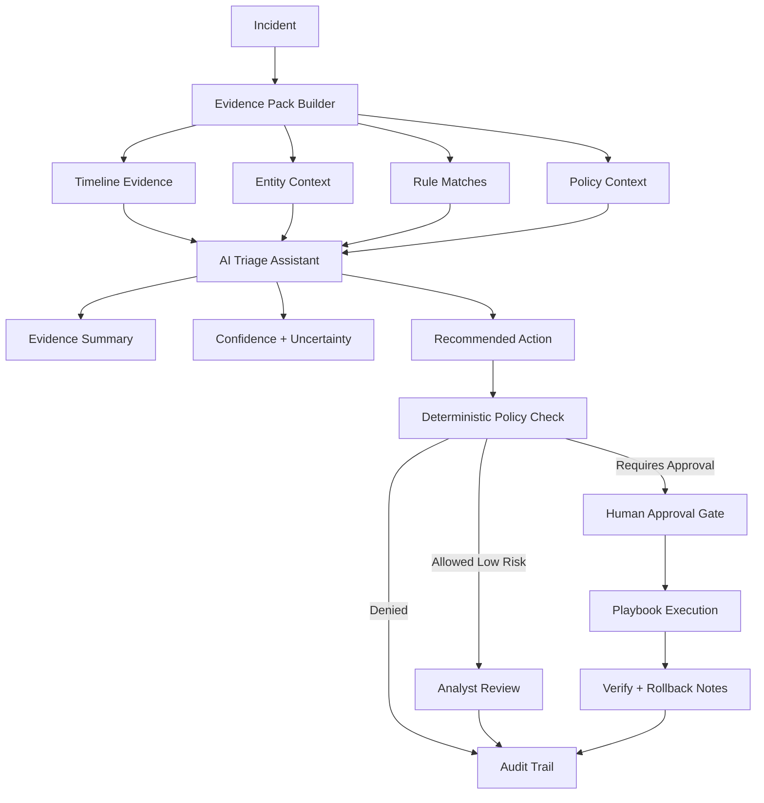

# AI Triage Workflow

```mermaid
flowchart TD
    Incident["Incident"] --> Pack["Evidence Pack Builder"]
    Pack --> Timeline["Timeline Evidence"]
    Pack --> Entities["Entity Context"]
    Pack --> Rules["Rule Matches"]
    Pack --> PolicyContext["Policy Context"]
    Timeline --> Assistant["AI Triage Assistant"]
    Entities --> Assistant
    Rules --> Assistant
    PolicyContext --> Assistant
    Assistant --> Summary["Evidence Summary"]
    Assistant --> Confidence["Confidence + Uncertainty"]
    Assistant --> Proposal["Recommended Action"]
    Proposal --> Policy["Deterministic Policy Check"]
    Policy -->|Allowed Low Risk| Analyst["Analyst Review"]
    Policy -->|Requires Approval| Approval["Human Approval Gate"]
    Policy -->|Denied| Audit["Audit Trail"]
    Approval --> Playbook["Playbook Execution"]
    Analyst --> Audit
    Playbook --> Verify["Verify + Rollback Notes"]
    Verify --> Audit
```
