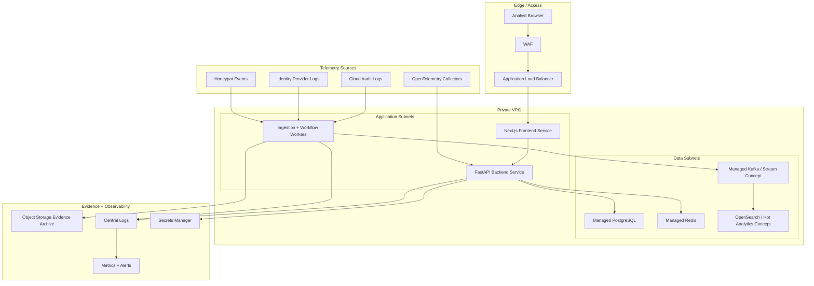

# Conceptual AWS Reference Architecture

This diagram is a sanitized architecture concept. It does not describe live infrastructure, account IDs, hostnames, IP addresses, or deployed resources.

```mermaid
flowchart TB
    subgraph Edge["Edge / Access"]
        User["Analyst Browser"]
        WAF["WAF"]
        ALB["Application Load Balancer"]
    end

    subgraph VPC["Private VPC"]
        subgraph App["Application Subnets"]
            Frontend["Next.js Frontend Service"]
            Backend["FastAPI Backend Service"]
            Workers["Ingestion + Workflow Workers"]
        end

        subgraph Data["Data Subnets"]
            Postgres["Managed PostgreSQL"]
            Redis["Managed Redis"]
            Stream["Managed Kafka / Stream Concept"]
            Search["OpenSearch / Hot Analytics Concept"]
        end
    end

    subgraph Evidence["Evidence + Observability"]
        S3["Object Storage Evidence Archive"]
        Logs["Central Logs"]
        Metrics["Metrics + Alerts"]
        Secrets["Secrets Manager"]
    end

    subgraph Sources["Telemetry Sources"]
        OTel["OpenTelemetry Collectors"]
        CloudTrail["Cloud Audit Logs"]
        Identity["Identity Provider Logs"]
        Honeypot["Honeypot Events"]
    end

    User --> WAF --> ALB --> Frontend
    Frontend --> Backend
    OTel --> Backend
    CloudTrail --> Workers
    Identity --> Workers
    Honeypot --> Workers
    Backend --> Postgres
    Backend --> Redis
    Workers --> Stream
    Stream --> Search
    Workers --> S3
    Backend --> Secrets
    Backend --> Logs
    Workers --> Logs
    Logs --> Metrics
```
