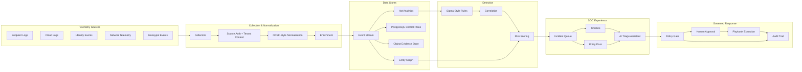

# Reference Architecture

```mermaid
flowchart LR
    subgraph Sources["Telemetry Sources"]
        Endpoint["Endpoint Logs"]
        Cloud["Cloud Logs"]
        Identity["Identity Events"]
        Network["Network Telemetry"]
        Honeypot["Honeypot Events"]
    end

    subgraph Ingest["Collection & Normalization"]
        Collector["Collectors"]
        Auth["Source Auth + Tenant Context"]
        Normalize["OCSF-Style Normalization"]
        Enrich["Enrichment"]
    end

    subgraph Stores["Data Stores"]
        Stream["Event Stream"]
        Hot["Hot Analytics"]
        Control["PostgreSQL Control Plane"]
        Evidence["Object Evidence Store"]
        Graph["Entity Graph"]
    end

    subgraph Detect["Detection"]
        Rules["Sigma-Style Rules"]
        Correlation["Correlation"]
        Risk["Risk Scoring"]
    end

    subgraph SOC["SOC Experience"]
        Queue["Incident Queue"]
        Timeline["Timeline"]
        Entities["Entity Pivot"]
        AI["AI Triage Assistant"]
    end

    subgraph Response["Governed Response"]
        Policy["Policy Gate"]
        Approval["Human Approval"]
        Playbook["Playbook Execution"]
        Audit["Audit Trail"]
    end

    Sources --> Collector --> Auth --> Normalize --> Enrich --> Stream
    Stream --> Hot
    Stream --> Control
    Stream --> Evidence
    Stream --> Graph
    Hot --> Rules --> Correlation --> Risk
    Graph --> Risk
    Risk --> Queue
    Queue --> Timeline
    Queue --> Entities
    Timeline --> AI
    Entities --> AI
    AI --> Policy --> Approval --> Playbook --> Audit
    Policy --> Audit
```
