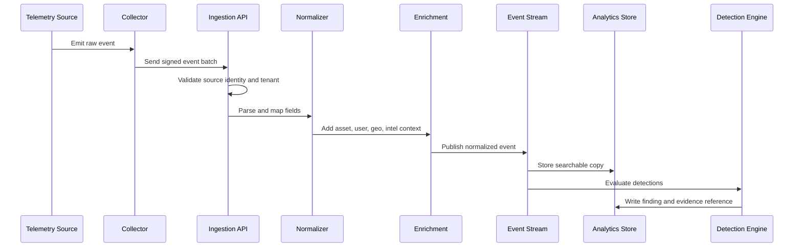

# SIEM Ingestion Flow

```mermaid
sequenceDiagram
    participant Source as Telemetry Source
    participant Collector as Collector
    participant API as Ingestion API
    participant Normalize as Normalizer
    participant Enrich as Enrichment
    participant Stream as Event Stream
    participant Store as Analytics Store
    participant Detect as Detection Engine

    Source->>Collector: Emit raw event
    Collector->>API: Send signed event batch
    API->>API: Validate source identity and tenant
    API->>Normalize: Parse and map fields
    Normalize->>Enrich: Add asset, user, geo, intel context
    Enrich->>Stream: Publish normalized event
    Stream->>Store: Store searchable copy
    Stream->>Detect: Evaluate detections
    Detect->>Store: Write finding and evidence reference
```
