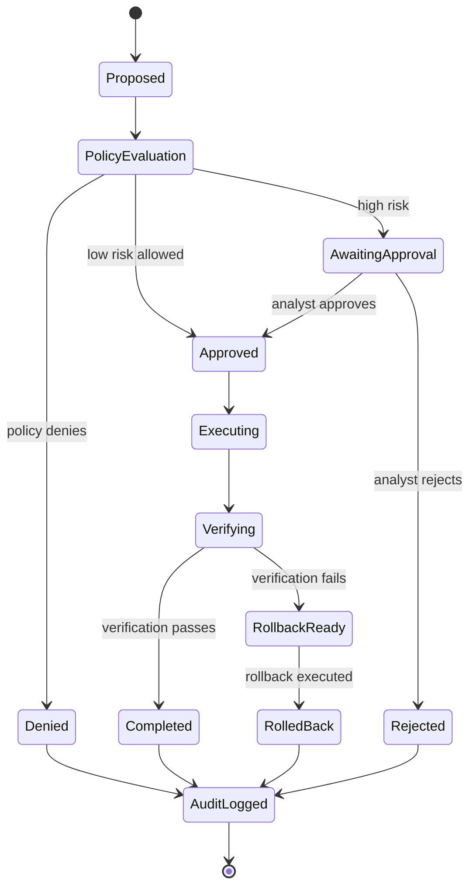

# SOAR Approval Flow

```mermaid
stateDiagram-v2
    [*] --> Proposed
    Proposed --> PolicyEvaluation
    PolicyEvaluation --> Denied: policy denies
    PolicyEvaluation --> Approved: low risk allowed
    PolicyEvaluation --> AwaitingApproval: high risk
    AwaitingApproval --> Approved: analyst approves
    AwaitingApproval --> Rejected: analyst rejects
    Approved --> Executing
    Executing --> Verifying
    Verifying --> Completed: verification passes
    Verifying --> RollbackReady: verification fails
    RollbackReady --> RolledBack: rollback executed
    Denied --> AuditLogged
    Rejected --> AuditLogged
    Completed --> AuditLogged
    RolledBack --> AuditLogged
    AuditLogged --> [*]
```
