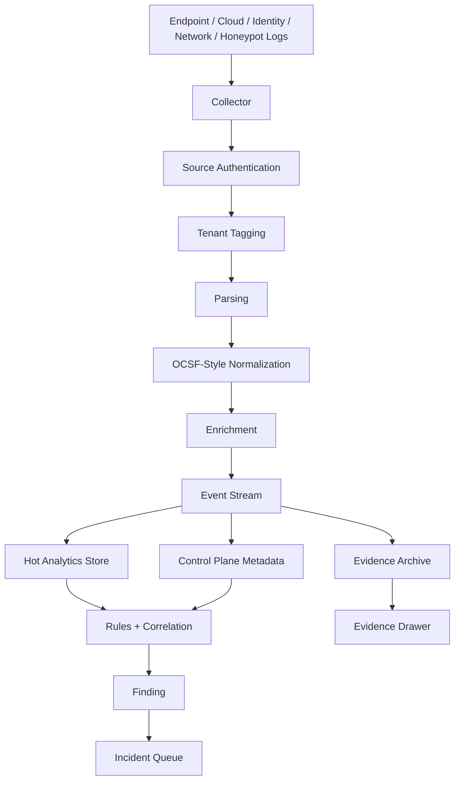

# Telemetry Flow

```mermaid
flowchart TD
    A["Endpoint / Cloud / Identity / Network / Honeypot Logs"] --> B["Collector"]
    B --> C["Source Authentication"]
    C --> D["Tenant Tagging"]
    D --> E["Parsing"]
    E --> F["OCSF-Style Normalization"]
    F --> G["Enrichment"]
    G --> H["Event Stream"]
    H --> I["Hot Analytics Store"]
    H --> J["Control Plane Metadata"]
    H --> K["Evidence Archive"]
    I --> L["Rules + Correlation"]
    J --> L
    K --> M["Evidence Drawer"]
    L --> N["Finding"]
    N --> O["Incident Queue"]
```
